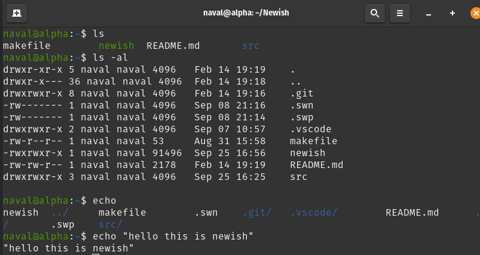

## SHELL - **New**ish

compile using 

```bash
make main
```
run using

```
./newish
```

## Assumptions
1. Commands are only upto 1024 characters long. 
2. history.txt should not be deleted during shell execution. Will still function as normal but history will be lost.
3. All commands **must** end with a `&` or `;` or `\n`
4. I assume processes with state R and S only are "Running" processes
5. builtin programmes cannot receive signals hence cannot be interrupted.


## Thumbnails

  

## Descriptions

- **src/**  : contains all the code base.
- **src/builtin**  : contains all the builtin functions like `cd`,`ls`,`discover`,`echo`,`pinfo`,`sig` etc.
- **main.c** : contains while loop.
- **parser.c** : contains the parser.
- **prompt.c** : contains the code required to generate prompt
- **execute.c** : contains all the code required to create a new fork and execute the programmes.
- **history.c** : data structure used to store history.
- **processes.c** : data structure used to store processes information.

**NOTE** : in case of ambiguity, it mimics the behavior of bash.

## File Structure

```
.
├── makefile
├── newish
├── README.md
└── src                 \\ contains all the source code
    ├── builtins        \\ contains all the builtin function 
    │   ├── cd.c
    │   ├── cd.h
    │   ├── discover.c
    │   ├── discover.h
    │   ├── echo.c
    │   ├── echo.h
    │   ├── fgbg.c
    │   ├── fgbg.h
    │   ├── jobs.c
    │   ├── jobs.h
    │   ├── ls.c
    │   ├── ls.h
    │   ├── pinfo.c
    │   ├── pinfo.h
    │   ├── sig.c
    │   └── sig.h
    ├── execute.c
    ├── execute.h
    ├── headers.h
    ├── history.c
    ├── history.h
    ├── history.txt
    ├── io.c
    ├── io.h
    ├── main.c
    ├── parser.c
    ├── parser.h
    ├── process.c
    ├── process.h
    ├── prompt.c
    ├── prompt.h
    ├── signal.c
    ├── signal.h
    ├── utils.c
    └── utils.h

2 directories, 39 files
```
